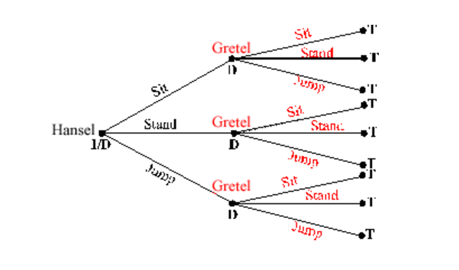

# Esercizi

## ESERCIZI TREE SEQUENZIALI

Hansel and Gretel take part in a sequential-move game. Hansel moves
first, Gretel moves second, and each player moves only once

Draw a game tree for a game in which Hansel and Gretel each have
three possible actions (Sit, Stand, Jump) at each node. How many of
each node type are there ?

STRATEGIE DOMINATE 

guardo i primi valori e guardo quli righe sono inferiori, guardo le colonne e guardo quali secondi numeri sono inferiori

- strectly : tutti i valori dominati →
- weakly : solo un valore dominato →

---

STRATEGIE DOMINANTI 

guardo le righe e i primi valori  quli di questi sono superiori , guardo le colonne e guardo quali secondi numeri sono superiori 

NASH EQUILIBRIUM 

- eliminiare le strategie dominate
- cerchi : prendo una colonna e guardo quale è il primo valore più alto, prendo la seconda colonna e guardo quale è il primo valore migliore, prendo la prima riga e guardo quale è il secondo valore migliore

GAME TREE 

prendo la parte di partenza e faccio le frecce in base a che decisioni ha poi alle decisioni attacco la seconda parte con le sue decisioni 

GAME TREE rolback equilibrium : partendo da un arco in base a chi è la parte (primo o secondo valore del payof) faccio la freccia su quello che ha il valore più alto e passo il valore.

---

CONSTANT SUM e ZERO SUM : serve per capire se un gioco è costant sum

tabella :            A,B    C,D 

                  E,F    G,H

se (a+b) = (c+d) = (e+f) = (g+h) allora il gioco è un constan sum game

se tutti le sommo sono zero è detto anche zero sum game cioè (a+c+e+g) - (b+d+f+h) = 0

---

CALCOLO PROBABILITà PAYOFF IN STRATEGIE MISTE (senza nash equilibrium)

payoff attesto evert per navratilova q mix strat= [payoffDL*p + payoffDL2*(1-p)]*q + [payoffCC*p +payoffCC2(1-p)]*(1-q)

CALCOLO NASH EQUILIBRIUM MIXED STRATEGY 

tabella :            A,B    C,D 

                  E,F    G,H

PROBABILITA’ PAYOFF RIGA = B*p + F*(1-p) = D*p+H*(1-p) 

PROBABILITA’ PAYOFF COLONNA =  A*q + C*(1-q) = E*q+F*(1-q)

CALCOLO PAYOFF 

tabella :            A,B    C,D 

                  E,F    G,H

PAYOFF ATTESO RIGA  = ( A * PROBABILITA COLONNA PRIMA RIGA PRIMA )  + ( C * PROBABILITA SECONDA COLONNA PRIMA RIGA)

PAYOFF ATTESO COLONNA = (B * PROBABILITA COLONNA PRIMA RIGA PRIMA) + (F * PROBABILITA COLONNA PRIMA RIGA SECONDA)

  

CALCOLO PROBABILITA PAYOFF CON 3 startegie : stessa cosa ma devo fare il sistema con 3 righe e uno con le tre colonne, formula 

tabella :            A,B    C,D  E,F

                  G,H    I,L   M,N

           O,P    Q,R  S,T

expected payof riga : 

Ax + C(1-x-z) + Ez 

Gx + I(1-x-z) +Mz              —→ metto a sistema queste 3 

Ox + Q(1-x-z) + Sz 

expected payof colonna: 

Bx + H(1-x-z) + Pz 

Dx + L(1-x-z) +Rz              —→ metto a sistema queste 3 

Fx +N(1-x-z) + Tz 

GRIM STRATEGY FORMULA PER MOLTI ANNI 

indentifico i payoff

- `C` = payoff cooperazione (qui: 64)
- `D` = payoff defezione una tantum (qui: 72)
- `P` = payoff punizione dopo defezione (qui: 57)

calcolo numeri chiave

- Guadagno immediato dalla defezione: `D − C` (qui: 8)
- Perdita per ogni periodo futuro: `C − P` (qui: 7)

formula : 

$\sum_{n=1}^{\infty} \frac{payoffDefezione/postDefezione/cooperazione}{(1+R)^n} = \frac{36}{R}$

conviene cooperare  finchè :  V_cooperate ≥ V_defect

$$
R = \frac{1 - p\delta}{p\delta}
$$

COME TROVARE L’ESS SIMMETRICO ( stesse parti che giocano in entrabi uomo)

tabella :            A,B    C,D 

                  E,F    G,H

immaginiamo di avere una riga con disertore e cooperatore e idem per le colomme 

fitness di un cooperatore : Gx + E(1-x)

fitness di un disertore :      Cx + A(1-x)

COME TROVARE L’ESS ASIMMETRICO ( diverse parti che giocano es. calciatore e portiere )

tabella :            A,B    C,D 

                  E,F    G,H

immaginiamo di avere una riga con disertore e cooperatore e idem per le colomme 

fitness di un calciatore-destra:  Eq+G(1-q)

fitness di un calciatore-sinistra: Aq+C(1-q)

fitness di un portiere-destra:     Dp + H(1-p)

fitness di un portiere-sinistra:     Bp + F(1-p) 

CALCOLO PAYOFF ESS 

dati :

| Tabella Payoff | HIGH | LOW |
| --- | --- | --- |
| HIGH | A,B | C,D |
| LOW | E,F | G,H |

L → perc_L   una parte di M  

H → perc_H  una parte di M

Calcoli: 

X = Mh → (E*perc_H) + (L *perc_L)    così calcolo : payoff di lh, hh

Y = hM→ (C*perc_H)+ (L *perc_L)     così calcolo : payoff di hl hh

Z = ML → (F*perc_H)+ (L *perc_L)     così calcolo : payoff di ll lh

K = LM → (D*perc_H)+ (L *perc_L)     così calcolo : payoff di ll lh

payoff MM : J =  (perc_H * perc_H * H) + (perc_L * perc_L * L )+ perc_H * perc_L * C + perc_H * perc_L * C  

FM = X*(1-m)+J*m 

FH = H*(1-m)+Y*m

FM < FH → PUO INVADERE 

FM > FH →  NON PUO INVADERE CONTINUO I CALCOLI 

se tutti gli invasori non possono invadere è una ESS 

 FM = Z*(1-m)+J*m 

FL = L*(1-m)+K*m

---

#### Trovo equilibrio di NASH (p e q)

> p prob che calciatore scelta sinistra e 1-p che scelga destra
> 

> q prob che portiere scelga sinistra e 1-p che scelga destra
> 

Trovo Q → devo rendere il calciatore indifferente tra left e right

30q + 90(1 - q) = 90q + 50(1 - q) → q=0.4

Trovo P → devo rendere il portiere indifferente tra left e right

70p + 10(1 - p) = 10p + 50(1 - p) → p=0.4

Kicker: Left 0.4, Right 0.6
Goalie: Left 0.4, Right 0.6

#### Payoff atteso nell’equilibrio

Per il kicker: 30(0.4) + 90(0.6) = 12 + 54 = 66

Per il golie: 70(0.4) + 10(0.6) = 28 + 6 = 34

### Gioco trattato come EGT

x = percentuale di kicker che tirano Left
1 - x = percentuale di kicker che tirano Right

y = percentuale di goalie che tuffano Left
1 - y = percentuale di goalie che tuffano Right

f_KLeft = 30y + 90(1 - y)

f_KRight = 90y + 50(1 - y)

f_GLeft = 70x + 10(1 - x)

f_GRight = 10x + 50(1 - x)

se f_KLeft > f_KRight
aumentano i kicker che tirano Left

se f_KRight > f_KLeft
aumentano i kicker che tirano Right

se f_GLeft > f_GRight
aumentano i goalie che si tuffano Left

se f_GRight > f_GLeft
aumentano i goalie che si tuffano Right

#### Punto stabile evolutivo

Per i kicker:
30y + 90(1 - y) = 90y + 50(1 - y)

y = 0.4

Quindi i golie devono essere:
40% Left
60% Right

Per i golie:
70x + 10(1 - x) = 10x + 50(1 - x)

x = 0.4

Quindi i kicker devono essere:
40% Left
60% Right

Questa è una **ESS polimorfica**, perché non sopravvive una sola strategia, ma una miscela stabile di tipi diversi perchè non ci sono 0%